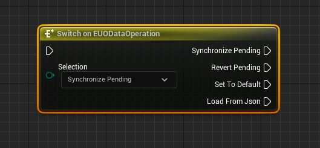
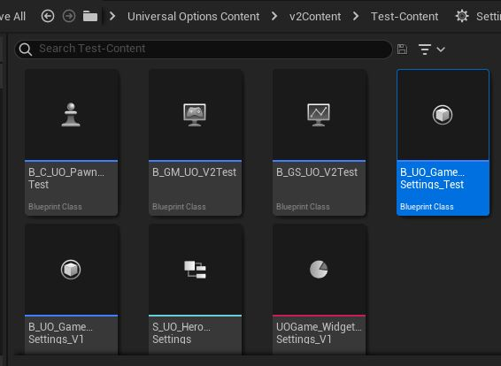
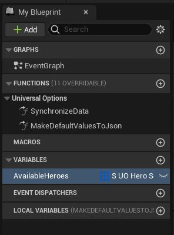
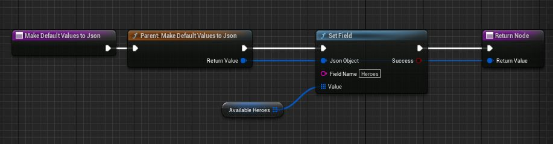
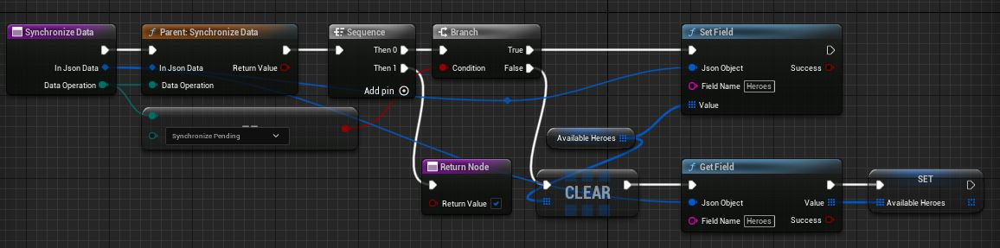

# How Saving Works

You can check [Creating your Own Game Settings](/3-CreatingYourOwnGameSettings.md) for examples of how to implement this in practice.  

## Serialization

As overviewed in [How Settings Work](/1-HowSettingsWork.md), our data gets serialized into and from a `JSON` object. However, Settings being `JSON` Objects is only needed at three stages: Setting Defaults, Loading, and Saving! For the rest of things, you can work with your regular types. All that matters is that we load to and from `JSON`. You can check the section below on [Manual Addition of Data](#manual-addition) for an example of what this looks like.  

### MakeDefaultValuesToJson

We convert our types to JSON and establish the defaults.  

MakeDefaultValuesToJson() happens after running `Initialize()`, so you can load data assets in `Initialize()` so that your defaults have already loaded custom data.  

We feed it to the object that will be treated as default. **Important for whenever we `RESET` our settings, as whatever gets stored here is what is treated as our defaults.**  

### SynchronizeData

Here, we control both Writing to the `JSON` object whenever we store Pending Changes which can be saved, or read from the source depending on the action.  

We have several Data Operation options:  
  

* **Synchronize Pending** is where we want to write to the `JSON`. Say our game modifies our `Available Heroes` Array variable through different points, and we run `Set Pending Changes`. Then `Synchronize Data` runs with `Synchronize Pending` where we can let our `JSON` object catch up.  
* **Revert Pending** is for reading from the `JSON` to undo pending changes. In the example above where the game modified `Available Heroes` but hasn't saved, we then rollback to the last loaded by the system, which can be either `Saved` or `Defaults`.  
* **Set To Default** is for whenever we `RESET` our given settings object, which we then read from what we defined at `MakeDefaultsValuesToJson`.  
* **Load From JSON** Lastly, this runs whenever the data is being loaded from our save file.  

## Supported Types

We can serialize any type of data that is not a UObject. Primitive types, strings, enums, structs are welcome. You can use a `Builder` programming pattern for serializing UObject data into structs and back from structs. [You can find more information on this pattern here](https://refactoring.guru/design-patterns/builder).  

## Registering your Variables

To explain this, let's look at our `Test` Game Settings.  
  

Here, we are going to be demonstrating working with a custom struct, `S_UO_HeroSettings`.  
  

### Automatic Addition

You can now add support to any of your Properties (non-object) by tagging it with SaveGame. Make sure that you didn't tag it as Transient!  

```cpp
//Supports any primitives, FName and FString, as well as Enumerators
UPROPERTY(SaveGame)
bool bMySavedBoolean = false;

//Supports any USTRUCT structures, check "1-Working with JSON" for more information
UPROPERTY(SaveGame)
TArray<FMyStruct> MyStructArray;

//Can also save maps that can convert its key type to a string, such as primitives, strings, and Gameplay Tags. 
UPROPERTY(SaveGame)
TMap<FString, FMyStruct> MyStructMap;
```

Make sure that your Settings class has, either in defaults or Instanced Settings, `bEnableProcessSaveGameProperties` set to true!  

  

Whenever Save Game Property saving is supported, you also have the option to do a deep check of what you'd like to share with `bEnableDeepAnalysisOfSaveGameProperties`. Take the example:  

```text
Say you have the following structure
USTRUCT() struct FMyStruct { UPROPERTY(SaveGame) bool bMyBool, UPROPERTY() float MyFloat }

and then in our settings object,
UPROPERTY(SaveGame) FMyStruct StructVar

bEnableDeepAnalysisOfSaveGameProperties = false means that when we run ToJson(StructVar), where both bMyBool and MyFloat get turned into Json,
{ "bMyBool" : false, "MyFloat" : 42 }

bEnableDeepAnalysisOfSaveGameProperties = true true means we do a recursive check inside FMyStruct, and only bMyBool would get turned into Json.  
{ "bMyBool" : false }
```

### Manual Addition

In `MakeDefaultValuesToJson`:  
  

In `SynchronizeData`:  
  
