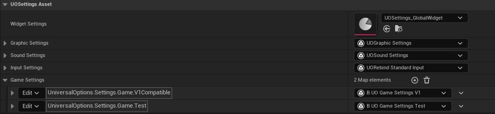
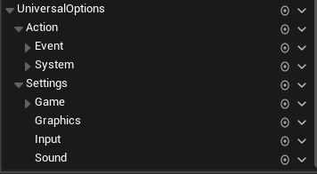
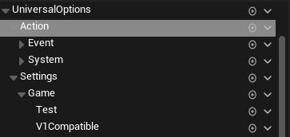

# How Settings Work

When opening our `UOSettings_Defaults` Asset, we get greeted with the following:  
  

Before diving into these specifically, let's go over the general layout of the framework.  

* The Framework is controlled by the `Game Instance Subsystem` class `UUOUniversalOptions`.  
* Each Setting type is a class of type `UUOSettingsBase` and they are kept alive by the system.  
* We load these Objects via our `UUOSettingsAsset` as Instanced Objects, allowing us to set both the specific class of them as well as their settings at the data level.  
* Settings are handled as `JSON` objects. Each settings class gets loaded from and serialized to a `JSON` object.  
* We organize our settings via `Gameplay Tags` of structure `UniversalOptions.Settings`  

> Note: For those unfamiliar with the concept, you can check [this wikipedia link](https://en.wikipedia.org/wiki/JSON) on `JSON` basics.  

## Gameplay Tag System

The plugin comes with the following tags:  
  

### Setting Types

* We have the following types of settings:  
  * Graphic Settings `UniversalOptions.Settings.Graphics`  
  * Sound Settings  `UniversalOptions.Settings.Sound`  
  * Input Settings `UniversalOptions.Settings.Input`
  * Game Settings `UniversalOptions.Settings.Game`  

For access in C++, check `...PluginDirectory/Source/UniversalOptions/(Public or Private)/Defaults/UONativeTags`, for example `UO_Settings_Graphics`.  

You can expand this system by creating new tags and applying them to your given objects. This is especially important for our Game Settings, which we'll explore deeper further.  
  

For the Other tags like `UniversalOptions.Action`, check Working with The System below.  

---  

## Universal Options Subsystem

### Initiation

Extending the brief explanation in the preface of this document, our Game Instance Subsystem is initialized right after the Game Instance runs Init()/Initialize().  

* We load the Data Asset specified in our [Project Settings](/README.md#loading-settings) and proceed to load the instanced objects defined in that data settings data asset, which depend on both the data asset and the project [Initialization Settings](/README.md#initialization-settings).  
* We check for save game files and proceed to synchronize the applicable data if such is found. This is also the stage in which we check for V1 backwards compatibility.  

### Lifetime

For game purposes, Universal Options is alive at all times, except processes which proceed the Game Instance initiatizling and exceed the Game Instance Deinitalizing. Our system keeps the Data assets and the different setting objects alive throughout, ensuring data access.  

### Setting Lifetime

The initiation process of a settings class is as follows:  

* Creation/Loading from Settings Data Asset inside the Subsystem.  
* We Initialize the Object.  
* We check and load serialized data from save game.  
* We Load the system and object.  

Our Setting Objects listen to things like on New World Initialized, On Actors Initialized, and On Beginplay.  

---  

## Working with the System

We utilize the Gameplay Tag and Instanced object framework to interact with the different features that the plugin has to offer. Please visit [Working with the Settings System](/1-WorkingwiththeSettingsSystem.md) for information on getting, setting, and working with the plugin in blueprint and c++. Please check [Working with Json](/1-WorkingWithJson.md) for information on reading, writing, and saving data.  

## Accessing and Paths

We utilize the concept of `JSON Paths` throughout our systems. In short, a json path gives us a way to navigate through a `JSON` Object.  

Refer to [Working with JSON Paths](/1-WorkingWithJson.md#json-paths) for more information.  

## Saving Information

We serialize the information that we store in each of our settings to `JSON` linked to a gameplay tag, and we convert from said JSON when loading that information.  

Refer to [How Saving Works](/1-HowSavingWorks.md) for information on how to register your types and update them with the system.  
