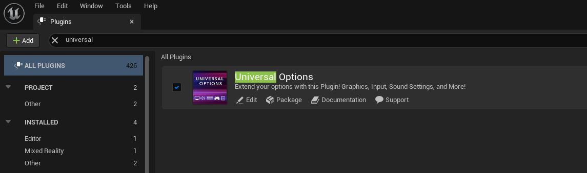
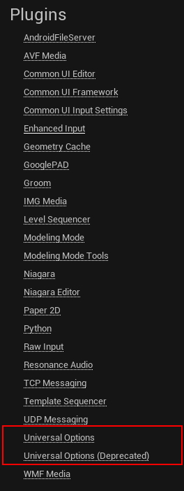
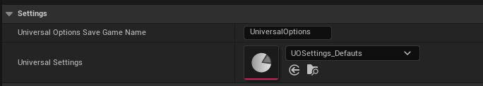
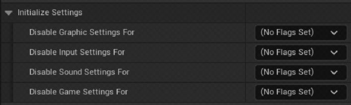
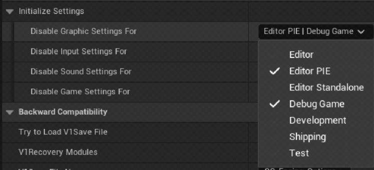
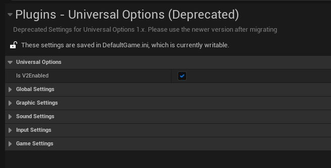
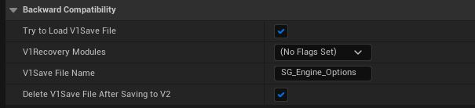
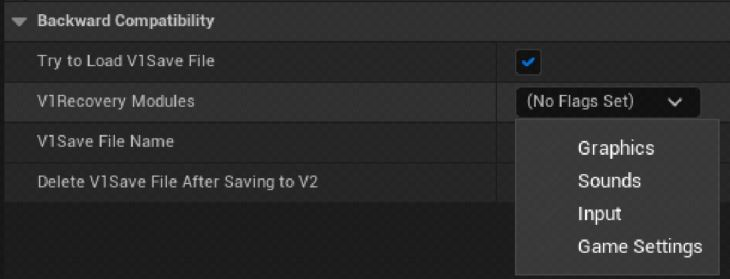

# Universal Options - Docs

[Unreal Marketplace Profile](https://www.unrealengine.com/marketplace/en-US/profile/M+Funderburk).  
[Discord Server](https://discord.gg/QHTTMQ6Pqw).  

Documentation for the Universal Options Marketplace Plugin, V2.3! Available for Unreal Engine 5.1 and above.  

**These Docs are for Universal Options V2.3**.  
[For documentation on v2.0 version of this plugin, visit this branch.](https://github.com/FunderburkM/CMEngineOptionsDocs/tree/V2.0-Docs)  
[For documentation on v2.1 version of this plugin, visit this branch.](https://github.com/FunderburkM/CMEngineOptionsDocs/tree/V2.1-Docs)  
[For documentation on v2.2 version of this plugin, visit this branch.](https://github.com/FunderburkM/CMEngineOptionsDocs/tree/V2.2-Docs) 

  

---  

This Readme focuses on the basic elements like plugin enabling, content location, and project settings. For more information, please refer to the following pages:  

* 0) [Version Changelog](/0-ChangeLog.md)  
* 1) [Getting Started](/1-GettingStarted.md)  
* 1) [How Settings Work](/1-HowSettingsWork.md)  
* 1) [How Saving Works](/1-HowSavingWorks.md)  
* 1) [Understanding Assets](/1-UnderstandingAssets.md)  
* 1) [Working With the Settings System](/1-WorkingWithTheSettingsSystem.md)  
* 1) [Working with JSON](/1-WorkingWithJson.md)  
* 2) [Platform Settings](/2-PlatformSettings.md)  
* 2) [System Settings](/2-SystemSettings.md)  
* 2) [Game Settings](/2-GameSettings.md), [Graphic Settings](/2-GraphicsSettings.md), [Input Settings](/2-InputSettings.md), [Sound Settings](/2-SoundSettings.md)  
* 3) [Working with Widgets](/3-WorkingWithWidgets.md)  
* 3) [Creating your own Game Setting](/3-CreatingYourOwnGameSettings.md)  

## Content

The Plugin's technical name is `CM_Engine_Options`, and its friendly name is `Universal Options`. Finding the plugin by folder will be using its technical name, either `CM_Engine_Options`, or `CMEngineOptions`, whilst its display name inside the editor will follow its friendly name.  

To enable the plugin, go to Plugins window and search for Universal Options and enable the plugin.  
  

You can find the files and content inside the Plugin Directory - Universal Options.  
  

All uassets related to V1.x elements have been moved to `Content/Deprecated` as shown above. `Content/General Content` contains demo textures and sound files for our test setup. `Content/v2 Content` is where we'll be working with. `Map_Test_Options` is the test map for v1.x, and `Map_Test_Options_V2` for the latest.  

Inside `v2 Content`, we'll see our main Data assets for settings and widget settings.  
  

## Loading Settings

### Loading Important Settings

As of v2.3, we recommend using `UOSettings_Defaults_v2-3` data asset instead of `UOSettings_default`.   
  

### Loading Settings Basics

Before we continue, let's explain how to find them. Go to your Project Settings, and scroll down to Plugins section. `Universal Options (Deprecated)` is for the V1.x settings, and `Universal Options` is for our active settings.  
  

For V2 loading settings, we declare our functionality at the data asset level. Here, you define your data asset to use and the save game name.
  

### Initialization Settings

You can specify in which circumstances should modules get disabled. For example, while testing in Editor or in debug mode, you may not want the graphic system to automatically load and apply graphical settings.  
  
  

#### Platform Simulation Settings

In 2.2+, we now have platform simulation settings. You can check those docs [here](/2-PlatformSettings.md).  

### Backwards Compatibility

You can control which version gets loaded (v1.x or v2) by going in the Deprecated Settings and checking this option:  
  

We can also check and recover for V1 save files that your project may have already! In the `Universal Options` section, head down to `Backward Compatibility` category.  
  

The system is controlled by the `V1 Recovery Modules`, a bit flag where you can control which **saved** modules from V1 do we try to convert to V2.  
  
