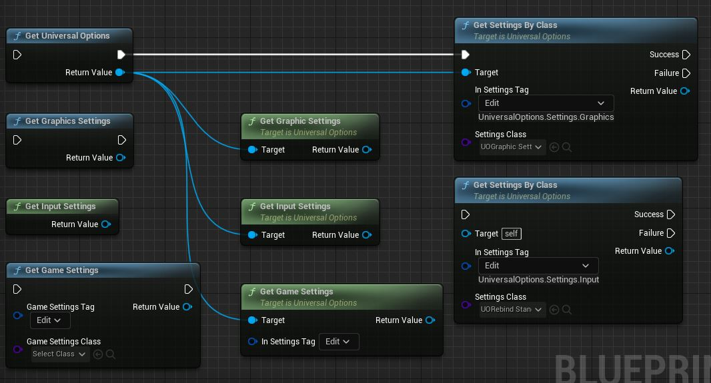
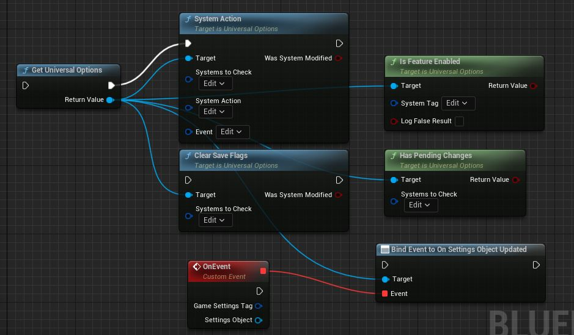
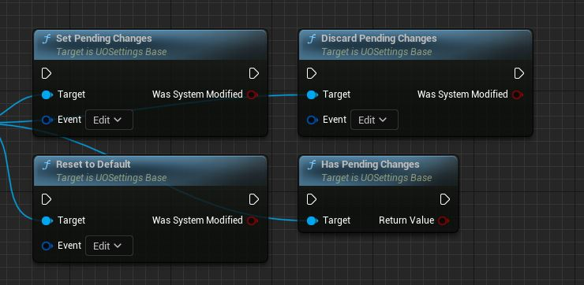
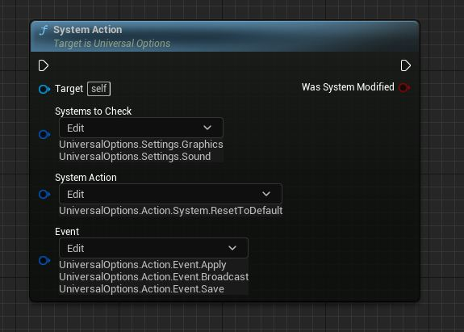
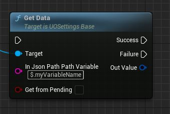

# Working with the Settings System

## Getting our Types

You can get our settings either by their Static functions `UUOSettingsType::Get()` or by the Universal Options Subsystem `UUOUniversalOptions::Get()` getters.  
  

For example in C++  

```cpp
if (auto* UO = UUOUniversalOptions::Get(this))
{
    if (auto* StandardRebind = UO->GetSettings<UUORebindStandardInput>(UO_Settings_Input_Standard))
    {
        //Do something with our Standard rebinding settings. 
    }
    //You can also do UO->GetInputSettings() and then cast, more UX options coming in future releases.
}

//another example

if (auto* Graphics = UUOGraphicsSettings::Get(this))
{
    //do something with our graphic settings
}
```  

---  

## Understanding the Settings System  

At the Subsystem level, there are several getters for given setting types (as shown above) as well as widget options. For interacting with the Saving and applicating settings elements. For interacting with the save system, these are the main elements:  
  

These actions are also available at the per-setting level  
  

* **System Action** is in charge or Writing to the System (more below).  
* **Clear Save Flags** will not modify the applied runtime settings, but it'll delete the items in the save game level. For example, say that you have loaded custom settings, and want to delete the save file without resetting the runtime values currently applied (where they'll be applied either next time we load the game or until the next system action).  
* **Is Feature Enabled**  checks whether a given system is allowed to run. This is controlled by both our `Initiation Settings` and `Load System` specifics (more below), which act on them accordingly.  
* **Has Pending Changes** checks whether a given setting has modified settings that have not been applied or saved (more below).  

### Working with Tags

These concepts are used throughout both the subsystem and setting actions, so let's go over them with this example:  
  

* **Systems To Check** is `Gameplay Tag Container` that lets us choose the multiple systems that we want to interact with.  
  * Note: if you wish to interact with a specific Game System, you may chose that Tag specifically, say `UniversalOptions.Settings.Game.Test`. If you with this action to apply to all Game Settings present, choose `UniversalOptions.Settings.Game`.  
* **System Action** is a `Gameplay Tag` establishes what function will get run. This will trigger the nodes that you save above on a per-setting level.  
* **Event** is a `Gameplay Tag Container` that lets you control what type of function should be considered here. You can `APPLY`, `SAVE`, and `Broadcast` (more on broadcast in `Working with Settings` and `Responding to Changes`).  

---  

## Working with Settings

Going off from what's above and [our overview on serialization](/HowSettingsWork.md#saving-and-serialization), let's explain how to work with settings for both our classes and your custom game settings. We'll start by explaining our implementation of V1 Game Settings Blueprint. This class has a `Vector2D` property called `MouseMultipliers`, and `JSON-wise` we treat it as `$.mouseMultipliers`.  

We can modify `MouseMultipliers` in BP however and from wherever we like, however, we need an additional bit of logic for our settings system to register those changes. Let's take a look. We have `SetMouseX()` and `SetMouseY()` functions, which our [widget settings](/WorkingWithWidgets.md) interacts with.  
  
We check for differences in the Vector Component, and if it's different, we mutate `MouseMultipliers`. Then, we have the option of running two things:  

* `AddPendingBroadcast()` - this controls the Broadcast List (more about that in a bit)  
* `SetPendingChanges()` - this sets that there are pending changes in our system and run `SynchronizeData(EUODataOperation::SynchronizePending)`.  

This way, next time we run `SetPendingChanges` with an acting event (check the `Event` description above), the system will know there are pending actions to synchronize and then apply, save, and/or broadcast.  

Onto how broadcasts work, we have two ways of broadcasting changes:  

* Group Broadcasting. By Running `AddPendingBroadcast()` like in the image, we are saying that `$.mouseMultipliers` should get added to our Broadcast list, so that next time that we run the Broadcast action, it'll be included for our listeners to respond (check [Responding to Changes](#responding-to-changes)).  
* Single (or immediate) Broadcasting. By Running `AddPendingBroadcast("$.mouseMultipliers", UO_Action_Broadcast_Single)`, we are saying that we do not want to add `$.mouseMultipliers` to the Broadcast List and instead broadcast it to our listeners right now.  

  

> A good example of Single Broadcasting can be found in our Graphics Widget when we switch profiles. You'll see that when you switch from Global `Low` to `Medium`, all the individual graphic types will switch accordingly even though we have not applied, saved, nor group-broadcasted anything (as in Graphics Settings we also have things like `$.resolutionData`, `$.deviceData`, `$.screenData`, and we don't want those to get broadcasted right now, only our specific type).  

---  

## Accessing Data

### Working with Paths

The basics of `JSON Paths` is overviewed in the [How Settings Work](/HowSettingsWork.md#accessing-and-paths) section. We utilize `FUOJsonPath` for this functionality, which can analyze any json object (C++ level functionality). Our settings use this for reading, writing, and listening.  

#### Reading Data

 `UUOSettingsBase::GetData`  
  

Here's an example for how you can use this: Say that you want to access the Current Graphics Active Profile's Name.  
  

How you decide to work with these is up to you, this just showcasing how you can operate with them.  

#### Writing Data

`UUOSettingsBase::SetData()`.  

`SetData()`'s support is up to the specific Setting Class' `UUOSettingsBase::ParseSetData` implementation.  

> Our base C++ classes don't implement this, so we encourage to use specialized functions (for example, `UUOGraphicsSettings::SetGamma()`) when available.  

We include an example for working with this inside our V1 Test Game settings:  
  

So doing the following will be able to modify our `IsPermaDeath` variable, and in this case apply, save, and broadcast that specific setting.  
  

### Responding to changes

There are two main ways to keep up with the system's changes.  

1) By subscribing to our System's OnUpdated delegate and checking its tag type. For example, here we're filtering to respond to the graphics' settings.  
  

2) By path, using the Listener Framework. Any object implementing `IUOSettingsUpdateInterface` can subscribe and respond to these events, and use the `RegisterListener()` function for the settings themselves.  
  

`IUOSettingsUpdateInterface` is a C++-only interface. Our Widgets utilize this to automatically respond to this ([Check Widget Settings](/WorkingWithWidgets.md)). You can most easily respond to messages using our `UOSettingsListenerComponent`.  
> You can also use the component as a reference if you wish to do custom interface implementations on uobjects.  

#### Settings Listener Component

This Actor Component is a `Modular Gameplay Component`, so you can add it via Game Features.  

You can see it in use in our Test Content for the Pawn setup. Here we listen to the setting `UniversalOptions.Settings.Game.V1Compatible` and use `Subscribe To Specific Json Paths` (Listen Method #2), searching for the setting `$.mouseMultipliers`. You can see in the test level how this affects our Test Pawn's Rotating Rate.  
  
  

You can also subscribe to `All Activity Delegate` (Listen Method #1).  
  

### Working with JSON

In C++, we recommend checking our `UUOJsonUtilities` Function library. Your ustructs can just drop to have the conversion functions ready to go  

```cpp
UO_TO_JSON();
UO_TO_JSONVALUE();
UO_FROM_JSON();
```

#### Working with JSON Objects

You can check FJsonObject's documentation [here](https://docs.unrealengine.com/4.27/en-US/API/Runtime/Json/Dom/FJsonObject/), and FJsonObjectWrapper's documentation [here](https://docs.unrealengine.com/4.27/en-US/API/Runtime/JsonUtilities/FJsonObjectWrapper/).  

In C++, using the utility functions, for example when working with arrays:  

```cpp
//from struct to json
TArray<TSharedPtr<FJsonValue>> Array;
UUOJsonUtilities::MakeJsonArray(LegacyGameSettings, &Array);
InJsonData.JsonObject->SetArrayField(gameSettings, Array);

//from json to struct
const TArray<TSharedPtr<FJsonValue>>* Array;
if (InJsonData.JsonObject->TryGetArrayField(gameSettings, Array))
{
    UUOJsonUtilities::MakeArrayFromJson(LegacyGameSettings, Array);
}
```

Generally speaking:  

```cpp
//to access the json object inside the wrapper
TheJsonWrapperObject.JsonObject;
//so for example
if (TSharedPtr<FJsonValue> JsonValue = TheJsonWrapperObject.JsonObject.TryGetField("theNameOfMyField"))
{
    //do something with this.
}

//for writing, you just do 
TheJsonWrapperObject.JsonObject->SetField(TEXT("theNameOfMyField"), AJsonValue);

//you can also do specific queries, like for reading
bool bThebool;
if (TheJsonWrapperObject.JsonObject->TryGetBoolField(TEXT("theNameOfMyField")))
{
    //if you're looking for a value paired to "theNameOfMyField" to be of a specific type.
}

//and for writing
TheJsonWrapperObject.JsonObject->SetBoolField(TEXT("theNameOfMyField"), true);

//More information 
//https://docs.unrealengine.com/4.27/en-US/API/Runtime/Json/Dom/FJsonObject/
```

More information on how to use GetField functions and SetField functions, check the `FJsonValue` below in the JSON value section.  

In Blueprints, you can either work with our `FUOJsonValue` (check the section below) and convert things to json value before interacting with `JSON` objects, or you can use the default functionality in the engine's `Json Blueprint Utilities` plugin  
  

#### Working with JSON Values

You can check [this documentation page](https://docs.unrealengine.com/4.27/en-US/API/Runtime/Json/Dom/) for information on Json Values and how they operate.  

In C++, you can check our utility functions in `UUOJsonUtilities`, but most of the functionality related to values is in our struct wrapper `FUOJsonValue`, a wrapper for `TSharedPtr<FJsonValue>`.  

You usually create shared instances of the objects, for example:  

```cpp
//Creating an Array
TArray<TSharedPtr<FJsonValue>> TheJsonValueArray = {Some Valid Value};
TSharedPtr<FJsonValue> TheJsonValue = MakeShared<FJsonValueArray>(TheJsonValueArray);

//Creating an Object
TSharedPtr<FJsonObject> TheJsonObject = {Some Valid Value}; 
TSharedPtr<FJsonValue> TheJsonValue = MakeShared<FJsonValueObject>(TheJsonObject); 

//Creating Primitive types
//Some Number can be signed/unsigned integers, floats, double
double SomeNumber = 42;
TSharedPtr<FJsonValue> TheJsonValue = MakeShared<FJsonValueNumber>(SomeNumber);
bool bSomeBoolean = true;
TSharedPtr<FJsonValue> TheJsonValue = MakeShared<FJsonValueBoolean>(bSomeBoolean);
FString SomeFString = TEXT("Hello");
TSharedPtr<FJsonValue> TheJsonValue = MakeShared<FJsonValueString>(SomeFString);
```

Then you can set that value as a field:  

```cpp
//Say that we have a json wrapper
InJsonWrapper.JsonObject->SetField(TEXT("theNameOfMyField"), TheJsonValue);
```

Or save yourself the trouble of doing `MakeShared<>` manually by using one of `FJsonObject`'s functions. For example doing it from SomeNumber would just be:  

```cpp
InJsonWrapper.JsonObject->SetNumberField(TEXT("theNameOfMyField"), SomeNumber);
```

In Blueprints, you can check the functionality mentioned above from Epic's custom nodes from `Json Blueprint Utilities`, or if you want to work with `FUOJsonValue`, you can check our `UUOJsonBPUtilities`  
  

To convert from and to any type, you can use the following  
  

You can also use the specific functions, like `From Json Value (to Bool)` and the like.  
